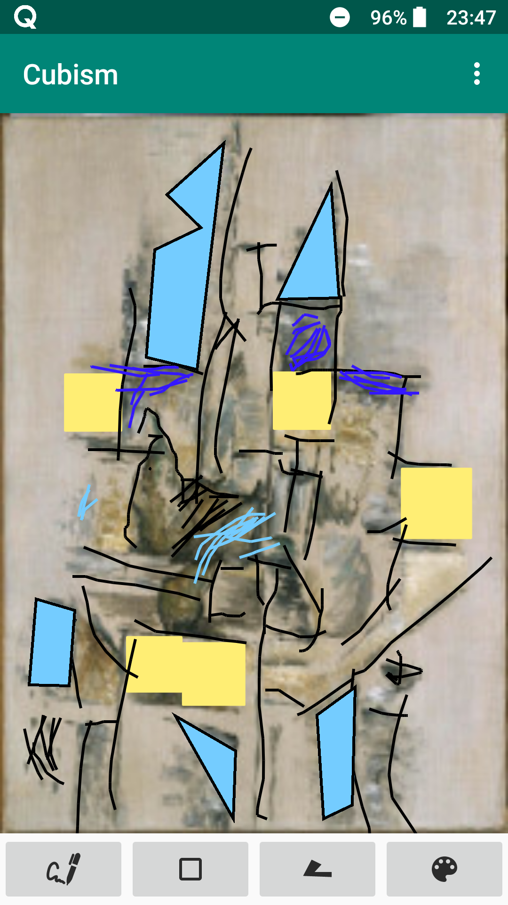
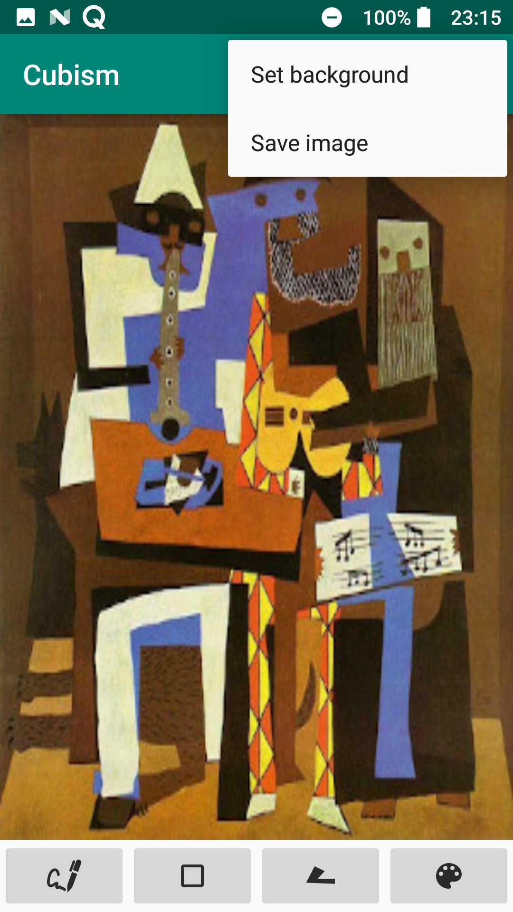
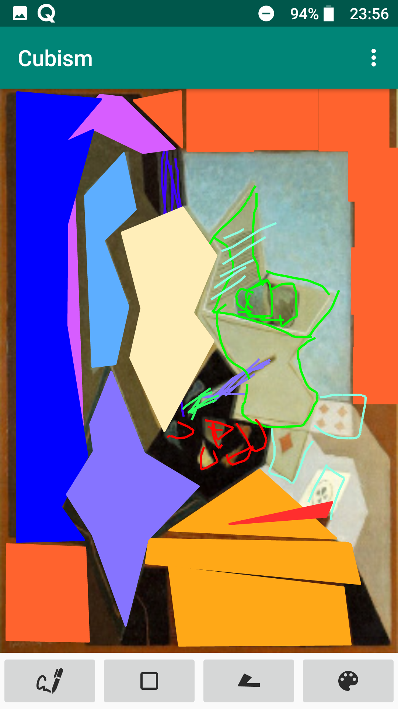
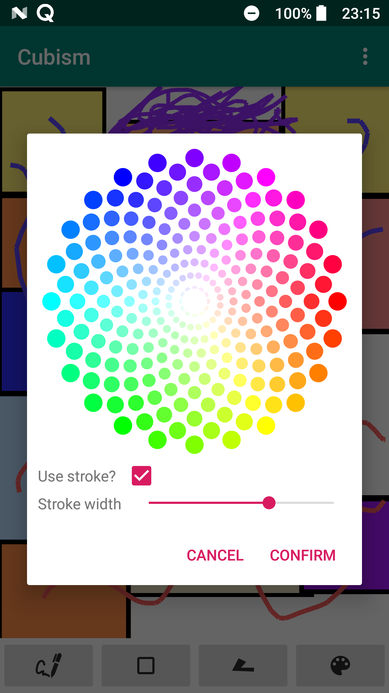

# DIM_Android
(Developed during the Software Engineer Master) An Android application that allows the user draw forms on a cubism's painting to reproduce it.

# Introduction
The developed application presents some famous paintings of the artistic movement of Cubism with the intention that the user recreates these with different drawing tools. Drawing is allowed in different ways:

- **Parallel drawing of non-straight lines**. The thickness of each line and its color can be configured.
- **Drawing of squares**. Squares can be resized and move. You can also modify their color, specify if they have border and the thickness of this. The creation of the squares is done by double tapping on the screen.
- **Drawing of free figures**. Selecting the third button in the image, we will begin to create a figure. Every touch of the screen will represent a point of this. The shape will be closed and filled with the configuration that we have selected when we return to click on the first point (which is distinguished from the rest by its color). 

The color of the lines and the fill of the figures and squares is set to through a dialog that is opened with the last button.

In the drop-down menu at the top right we find the options for:
- Change the background of the drawing panel: you can select paintings by some authors (Picasso,
Gray, Mondrian ...) or select none.
- Save the drawing panel as an image: for this action, permissions will be requested to
access the filesystem.

# Some user interfaces

